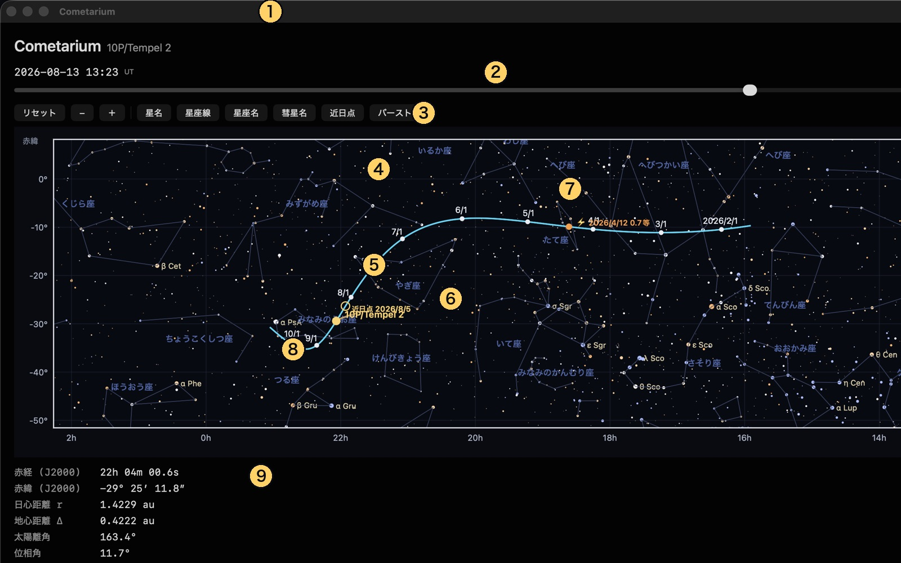
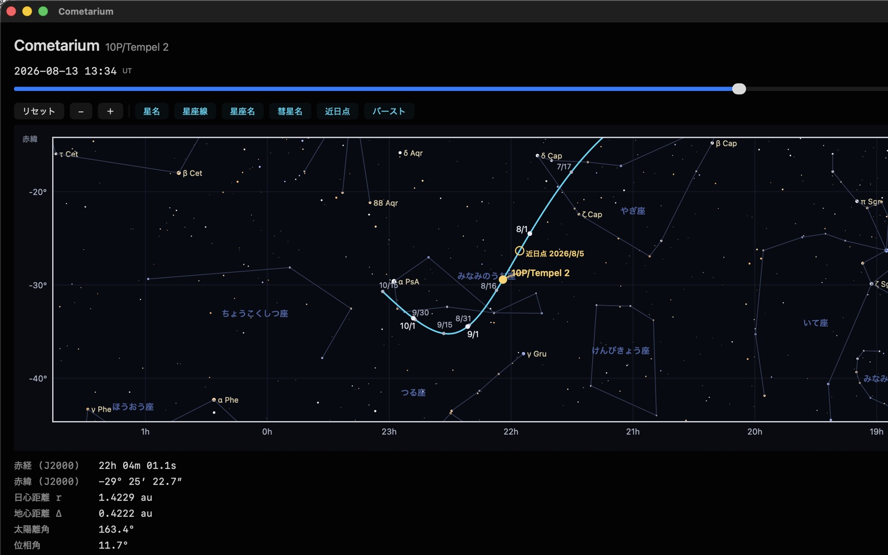
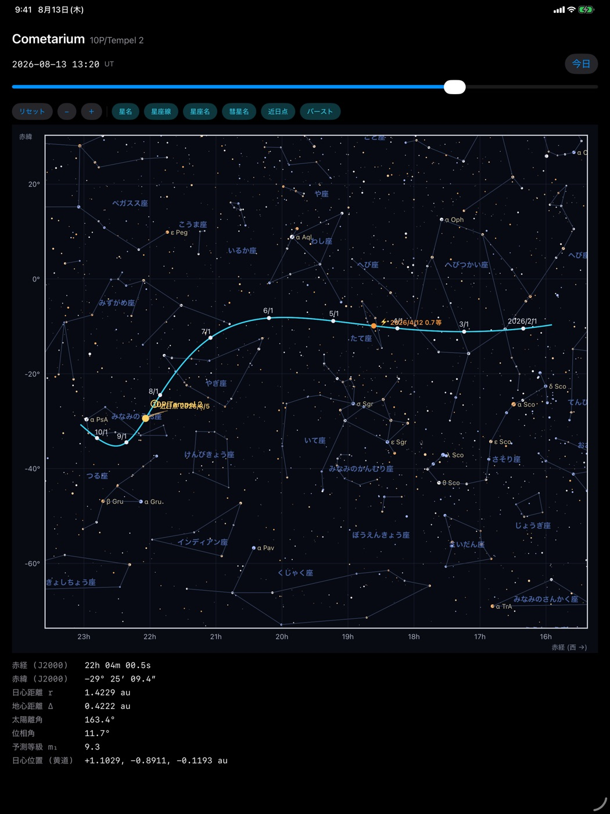

# Cometarium ユーザーマニュアル(無料版 1.0)

Cometarium は、彗星がいつ・どこに見え、どんな尾を引くのかを描く天文アプリです
(iPhone / iPad / Mac)。背景の星は実際の星表、彗星の位置は NASA/JPL の軌道解を
出発点にした N 体積分の結果、尾は太陽光の輻射圧と太陽風のモデルから計算しています。

- 無料版に収録されている彗星は **10P/Tempel 2**(2026年8月5日 近日点通過、地球最接近 0.4 au)
- **完全オフライン動作**。通信・データ収集・広告はありません
- 対応: iOS / iPadOS 17 以降、macOS 14 以降

---

## 1. 画面の見かた

| 番号 | 名称 | 内容 |
|---|---|---|
| ① | アプリ名と対象彗星 | いま表示している彗星 |
| ② | 日付スライダ | 収録期間内の任意の日時へ移動。起動時は「今日」 |
| ③ | 表示切替 | リセット・縮小 −・拡大 ＋ と、6つの表示レイヤー |
| ④ | 天球経路 | 収録期間の彗星の通り道(水色) |
| ⑤ | 日付目盛 | 経路上の日付。大きい丸が月初、小さい丸が中間の日付 |
| ⑥ | 近日点 | 太陽に最も近づく点と、その日付 |
| ⑦ | バースト | 突発的な増光が観測された位置・日付・増光量 |
| ⑧ | 現在位置 | ②で指定した日時の彗星。ダスト尾とプラズマ尾つき |
| ⑨ | 現在値 | その日時の位置・距離・明るさの数値 |

背景の星の**色は B−V 色指数**(青白い星ほど高温、オレンジの星ほど低温)、
**大きさは実視等級**に対応します。

## 2. 操作

| したいこと | Mac | iPhone / iPad |
|---|---|---|
| 日付を変える | スライダをドラッグ | スライダをドラッグ |
| 今日に戻す | 「今日」ボタン | 「今日」ボタン |
| 拡大・縮小 | ＋ / − ボタン | ＋ / − ボタン、または2本指のピンチ |
| 視野を動かす | 図の上をドラッグ | 図の上を1本指でドラッグ |
| 全体表示に戻す | 「リセット」 | 「リセット」 |
| ラベルを動かす | ラベルをつまんでドラッグ | ラベルを指でドラッグ |

拡大・縮小は**彗星を中心に**行われるので、倍率を上げても彗星が画面から逃げません。
最も縮小した状態で赤経24時間ぶん(全天)が収まり、それ以上は広がりません。

**ラベルはドラッグで動かせます。**「彗星名」「近日点」「バースト」のラベルは近日点の
前後で重なりやすくなります。読みにくいときは空いた場所へ移してください
(「リセット」で元の位置に戻ります)。

### 表示レイヤー

| ボタン | 表示されるもの |
|---|---|
| 星名 | 明るい星のバイエル符号(例: α CMa) |
| 星座線 | 星座の結び線 |
| 星座名 | 星座の名前。狭い場所では自動で間引かれます |
| 彗星名 | 現在位置の横に出る彗星名 |
| 近日点 | 近日点の印と日付 |
| バースト | アウトバーストの印と日付・増光量 |

## 3. 図の読み方

横軸は赤経、縦軸は赤緯(いずれも J2000.0)です。星図の慣習に従い、
**赤経は右へ行くほど小さく**なります(西が右)。南の空を見上げたときと同じ向きです。

現在位置には尾が描かれます。オレンジ色の扇はダスト尾(同じ大きさの塵が描く曲線＝
シンダインの束)、水色の線はプラズマ尾です。塵は太陽光の輻射圧で押し流されて曲がり、
プラズマは太陽風にほぼ沿ってまっすぐ伸びます。縮小表示では点にしか見えないので、
拡大してご覧ください。

## 4. 拡大すると何が変わるか

日付目盛の間隔は「彗星が**画面上で**どれだけ速く動くか」で決まります。そのため拡大
すると、月初だけだった目盛が半月ごと・10日ごと…と自動的に細分されます(図では
8/16・8/31・9/15・9/30)。暗い星も増え、星名も多く出ます。ラベルが重なる場所では
経路の反対側へ逃がし、そこも詰まっていれば点だけを残します。

## 5. 現在値の意味

| 項目 | 意味 |
|---|---|
| 赤経・赤緯 (J2000) | 天球上の位置(地心視位置) |
| 日心距離 r | 太陽から彗星までの距離(au。1 au ≒ 1億4960万 km) |
| 地心距離 Δ | 地球から彗星までの距離(au) |
| 太陽離角 | 地球から見た太陽と彗星の離れかた(0°=太陽と同方向、180°=真夜中に南中) |
| 位相角 | 彗星から見た太陽と地球のなす角 |
| 予測等級 m₁ | 全等級の予測値。COBS の観測に当てはめた光度式による |
| 日心位置(黄道) | 太陽を原点とする黄道座標の x, y, z(au) |

距離と位置は**光行時間を補正済み**です。表示されているのは「いまその光が地球に届いて
いる瞬間の彗星」の値です。

## 6. iPhone・iPad での表示

描かれる内容はどの機種でも同じです。iPad では横幅が広いぶん星座名や星名が多く出ます。
表示切替のボタン列は、画面が狭いときは左右にスクロールします。

## 7. 無料版と Pro 版

| 項目 | Cometarium(無料) | Cometarium Pro |
|---|---|---|
| 対象彗星 | 10P/Tempel 2 のみ | 収録彗星すべて |
| 天球経路・現在値 | ○ | ○ |
| 光度曲線・尾の形状・観測可能時間帯・太陽系軌道 3D | ○ | ○ |
| 太陽系 3D の比較彗星 | 220P のみ | 自由に追加 |
| 写真の重ね合わせ・測光・WCS 解析 | — | ○ |
| ボートルの生存限界図 | — | ○ |

1.0 は6つの画面をすべて搭載しています。

| 画面 | 内容 |
|---|---|
| 天球経路 | 恒星・星座の中を通る彗星の道すじ。日付目盛・近日点・バースト・現在位置と尾 |
| 光度曲線 | COBS の眼視/CCD 観測と、当てはめた光度式(±3σ 帯)、アウトバーストの期間 |
| 尾の形状 | 核を中心にした位置角図。シンダイン(β)・シンクロン・プラズマ尾・軌道・軌道面 |
| 観測可能時間帯 | 都道府県を選んで一晩の高度変化。太陽・月・薄明、出没と南中、月齢と離角、空の明るさ |
| 太陽系軌道 3D | 太陽・8惑星・彗星の軌道を任意の視点から。近日点・バースト・軌道面・春分点 |
| 現在値 | 指定時刻の位置・距離・離角・位相角・予測等級・日心位置 |

## 8. 計算とデータの出どころ

| 内容 | 出どころ |
|---|---|
| 軌道と天体暦 | NASA/JPL Horizons・SBDB・NAIF SPICE(DE440 / sb441) |
| 軌道の積分 | ASSIST(REBOUND 系)による N 体積分。惑星と主要小惑星の摂動、非重力加速度を含む |
| 光度と増光 | COBS(Comet Observation Database)の観測に基づく光度式の当てはめ |
| 星表 | Bright Star Catalogue(V ≤ 6.5) |
| 尾の形状 | Finson–Probstein のシンダイン/シンクロン、Burns–Lamy–Soter の β、太陽風による吹き流しモデル |

Credit: NASA/JPL-Caltech.
Comet magnitude data courtesy of COBS Comet Observation Database — <https://cobs.si>

## 9. よくある質問

**Q. オフラインでも使えますか。**
はい。位置計算も星図もアプリ内で完結し、通信は行いません。

**Q. 表示できる期間は決まっていますか。**
彗星ごとに、その回帰の前後をカバーする期間が収録されています。スライダの左端・右端が
その期間です。

**Q. どのくらい正確ですか。**
位置は JPL の軌道解を出発点にした N 体積分で、実測とほぼ一致します。ただし彗星の
**明るさ**は本質的に予測が難しく、実際の観測とずれることがあります。

**Q. ラベルが重なって読めません。**
ラベルはドラッグで移動できます。「リセット」で元に戻ります。

**Q. 彗星を増やせますか。**
無料版は 10P/Tempel 2 専用です。ほかの彗星は Cometarium Pro でご利用ください。

---

お問い合わせ: avellsky@gmail.com
© Cometarium, Avellsky
