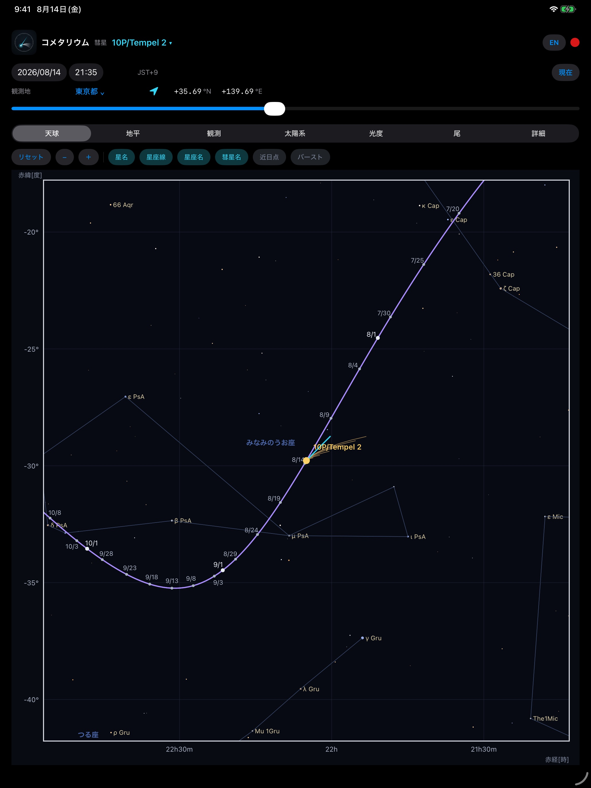
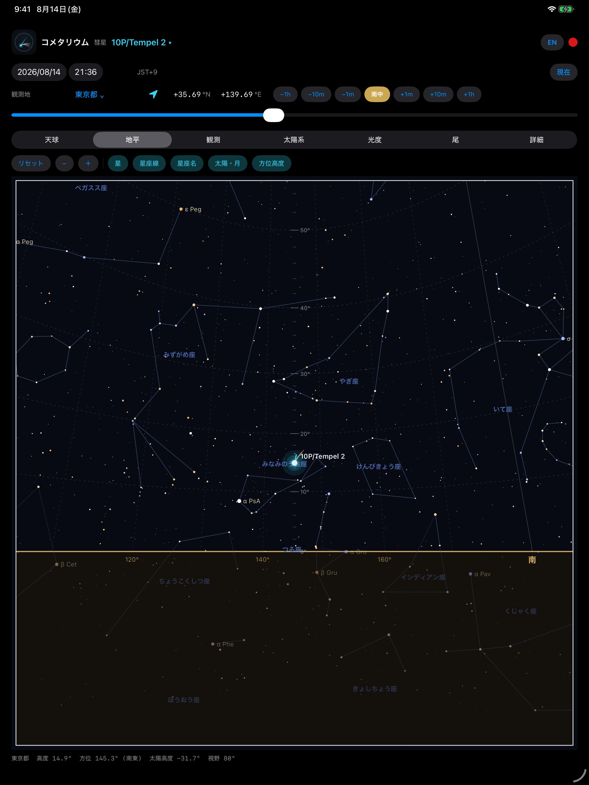
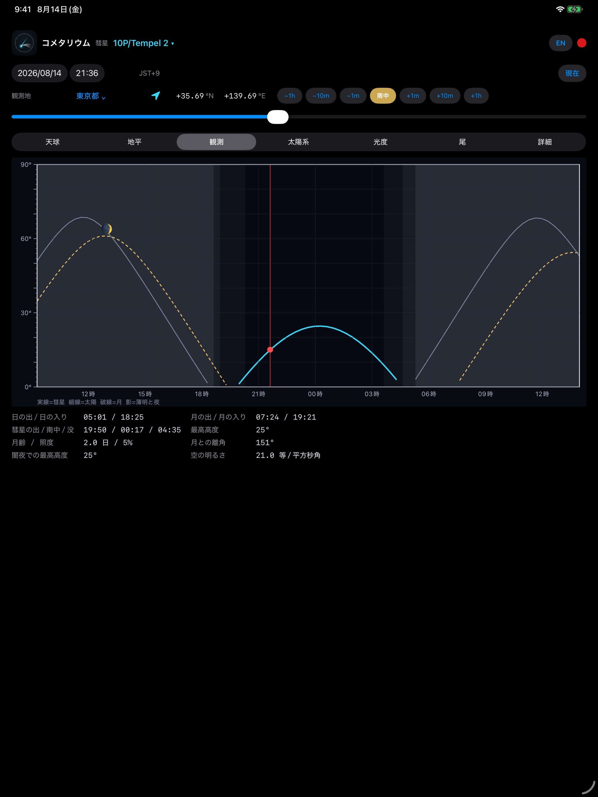
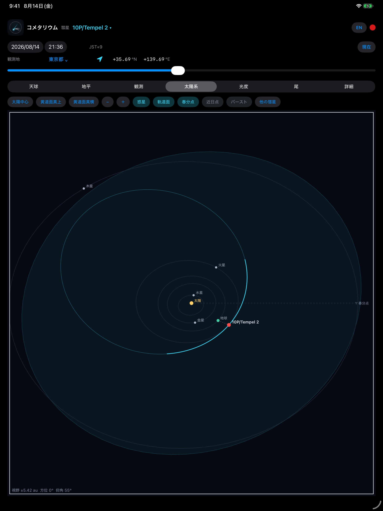
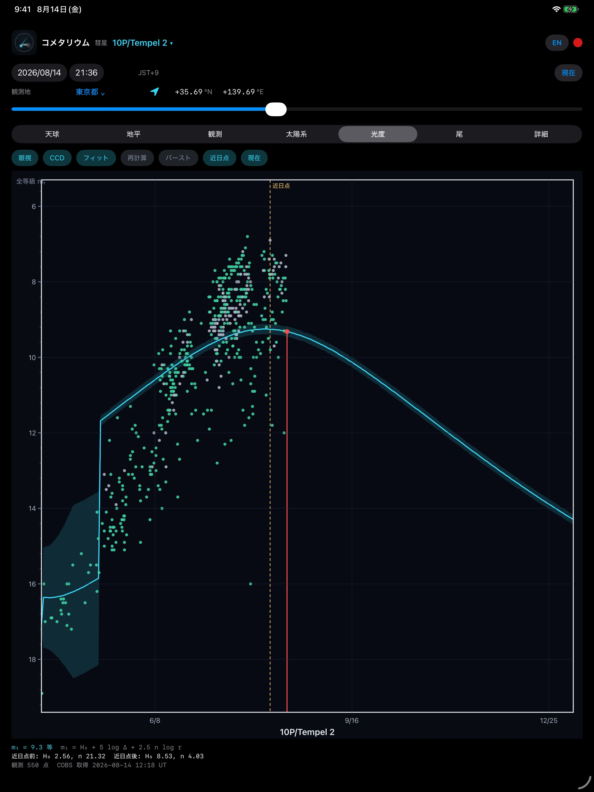
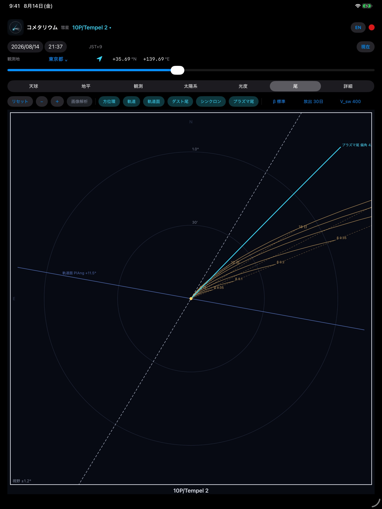
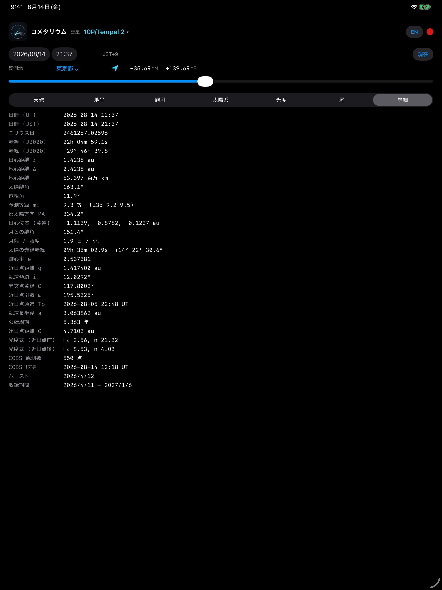
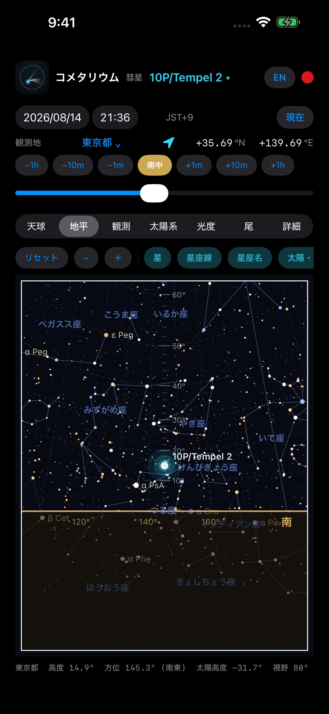

# Cometarium ユーザーマニュアル(無料版 1.0)

Cometarium は、彗星がいつ・どこに見え、どんな尾を引くのかを描く天文アプリです
(iPhone / iPad / Mac)。背景の星は実際の星表、彗星の位置は NASA/JPL の軌道解を
出発点にした N 体積分の結果、尾は太陽光の輻射圧と太陽風のモデルから計算しています。

- 無料版に収録されている彗星は **10P/Tempel 2**(2026年8月5日 近日点通過、地球最接近 0.4 au)
- **完全オフライン動作**。通信・データ収集・広告はありません
- 対応: iOS / iPadOS 17 以降、macOS 14 以降

---

## 1. 共通の操作

| 場所 | 内容 |
|---|---|
| 最上段 | アイコン(作者のページへ)、対象彗星のメニュー、**EN**(日英切替)、**赤い丸**(ナイトモード) |
| 2段目 | 日付・時刻(直接入力可)、時刻系と時差(例: JST+9)、**現在** |
| 3段目 | 観測地、**➤**(現在位置)、緯度・経度(直接入力可) |
| 4段目 | 時刻の微調整(−1h〜+1h)と **南中**(地平・観測で表示) |
| スライダ | 収録期間を端から端まで |
| パネル | 天球 / 地平 / 観測 / 太陽系 / 光度 / 尾 / 詳細 |

図はドラッグで移動、ピンチで拡大縮小、「リセット」で元に戻ります。Mac では地平の
視野を矢印キーでも動かせます。

## 2. 天球

赤道座標(J2000.0)の経路。赤経は右へ行くほど小さくなります(西が右)。日付の目盛は
画面上の移動速度で決まるため、拡大すると自動的に細かくなります。星の色は B−V 色指数、
大きさは実視等級。現在位置には「尾」パネルの設定を反映した尾が付きます。

## 3. 地平

観測地の空を彗星中心の心射図法で描きます。空の色は太陽高度で変わり、地平線・地面・
方位・高度目盛が入ります。方位は右へ行くほど増えます。目盛は視野に追従し(視野60°で
高度10°ごと、視野10°で1°ごと)、地平線下 20° までの星・太陽・月も薄く描きます。
彗星が沈んでいるときは視点が地平線で止まり「地平線の下」と表示します。彗星名は
ドラッグで移動できます。

## 4. 観測

一晩の彗星・太陽・月の高度。下に日の出/入り、月の出/入り、彗星の出・南中・没、
最高高度、月齢と照度、月との離角、闇夜での最高高度、空の明るさが出ます。

## 5. 太陽系

ドラッグで視点が回ります。太陽中心・地球中心・彗星中心、軌道面、春分点、近日点、
バーストの切替、「他の彗星」の重ね描き(無料版は 220P のみ)。

## 6. 光度

COBS の眼視・CCD 観測と、当てはめた光度式(±3σ)。現在の m₁、式
`m₁ = H₀ + 5 log Δ + 2.5 n log r`、近日点前後の H₀ と n、観測数、COBS 取得日時。
縦軸の刻みは等級の幅に応じて自動で細かくなります。

## 7. 尾

核を中心にした位置角図(北が上、東が左)。β の粗さ、放出時刻(3〜90日前)、太陽風速度
V_sw、尾長を選ぶとその場で計算し直し、天球と地平の尾にも反映されます。

## 8. 詳細

日時・位置・距離(au と km)・離角・位相角・予測等級・軌道6要素・光度式・COBS の
取得日時など30項目。距離と位置は光行時間を補正済みです。

## 9. iPhone での表示

## 10. 無料版と Pro 版

| 項目 | Cometarium(無料) | Cometarium Pro |
|---|---|---|
| 対象彗星 | 10P/Tempel 2 のみ | 収録彗星すべて |
| 天球・地平・観測・太陽系・光度・尾・詳細 | ○ | ○ |
| 太陽系の比較彗星 | 220P のみ | 自由に追加 |
| 写真の位置測定・測光・尾の解析 | — | ○ |
| 最新データの取得と光度曲線の再計算 | — | ○ |
| ボートルの生存限界図 | — | ○ |

## 11. 計算とデータの出どころ

| 内容 | 出どころ |
|---|---|
| 軌道と天体暦 | NASA/JPL Horizons・SBDB・NAIF SPICE(DE440 / sb441) |
| 軌道の積分 | ASSIST(REBOUND 系)。惑星と主要小惑星の摂動、非重力加速度を含む |
| 光度と増光 | COBS の観測に基づく光度式の当てはめ |
| 星表・星座 | Bright Star Catalogue(V ≤ 6.5)、d3-celestial の星座線 |
| 太陽・月・惑星 | Meeus『Astronomical Algorithms』と Standish の近似要素 |
| 尾の形状 | Finson–Probstein、Burns–Lamy–Soter の β、太陽風による吹き流し |
| 空の明るさ | Krisciunas & Schaefer 1991 (PASP 103, 1033) |

Credit: NASA/JPL-Caltech.
Comet magnitude data courtesy of COBS Comet Observation Database — <https://cobs.si>

## 12. よくある質問

**Q. オフラインでも使えますか。** はい。通信は行いません。

**Q. 位置情報は何に使いますか。** 観測地の緯度経度を入れるためだけで、端末の外には出しません。

**Q. ナイトモードとは。** 画面全体を赤くして、暗順応を保ったまま読める表示です。

**Q. どのくらい正確ですか。** 位置は JPL の軌道解を出発点にした N 体積分で実測とほぼ
一致します。**明るさ**は本質的に予測が難しく、実際の観測とずれることがあります。

**Q. 彗星を増やせますか。** 無料版は 10P/Tempel 2 専用です。ほかは Cometarium Pro で。

---

お問い合わせ: avellsky@gmail.com
© Cometarium, Avellsky
