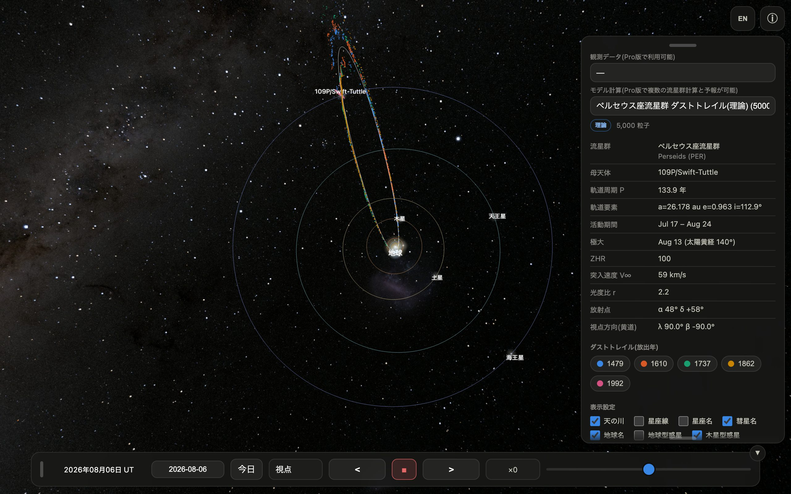
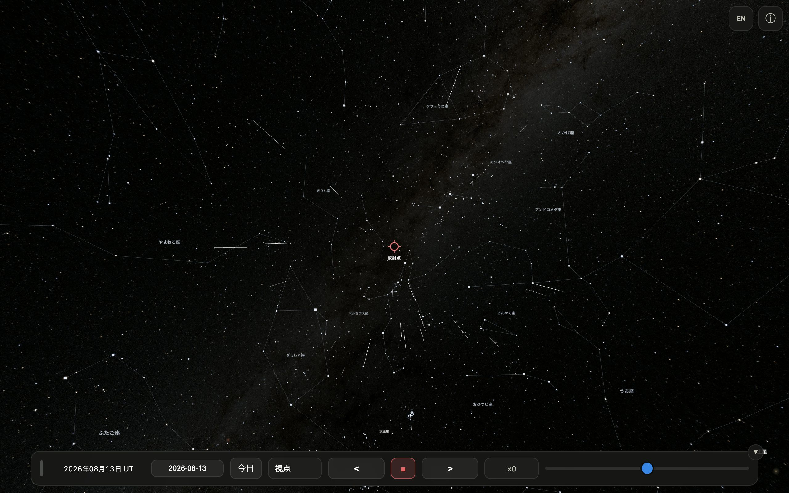

# Meteorium ユーザーマニュアル(無料版)

Meteorium は、流星群のもとになる「ダストトレイル」(彗星が軌道上に残した塵の帯)を
科学計算に基づいて 3D 表示する天文アプリです。無料版には、ペルセウス座流星群の
母彗星 109P/スウィフト・タトルが残した **5回帰ぶん(1479・1610・1737・1862・1992年)
のダストトレイル 5,000 粒子** が収録されています。

- 粒子の軌道は REBOUND/ReboundX による軌道積分(惑星重力+太陽放射圧)で計算
- 背景の空は NASA「Deep Star Maps 2020」8K 全天図
- 完全オフライン動作。データ収集・広告なし

---

## 1. 画面の構成

| 場所 | 内容 |
|---|---|
| 中央 | 3D 表示(ドラッグ=視点回転、ピンチ/ホイール=ズーム)|
| 右上 | EN/JP(言語切替)、ⓘ(パネル開閉)|
| 右パネル | データセット・ダストトレイル凡例・表示設定・視点・粒子設定 |
| 下部バー | 日時(UT)・日付入力・今日・視点・時間操作 |

パネルと下部バーは、つまみ(グリップ)をドラッグして画面内の好きな位置に移動できます。
パネル下端のつまみで表示の長さも調整できます。

## 2. ダストトレイル(放出年)

凡例の色付きチップは放出年ごとのトレイルです。タップで個別に表示/非表示を
切り替えられます。色は 3D 粒子と対応しています。

- **1992**: 前回回帰(1992年12月12日)で放出された最も新しい塵
- **1479〜1862**: 過去4回の回帰で放出され、軌道に沿って広がった塵

## 3. 表示設定

天の川 / 星座線 / 星座名 / 彗星名 / 地球名 / 地球型惑星 / 木星型惑星 / 惑星 /
軌道線 / **粒子** / 放射点 の ON/OFF。

起動時の既定値: 星座線・星座名・地球型惑星・放射点が OFF、他は ON。
(無料版は毎回この既定値で起動します)

## 4. 視点

| ボタン | 動作 |
|---|---|
| **黄道面北** | 太陽系を真上から。押すたびに 45° ずつ時計回りに回転 |
| **黄道面南** | 真下から。押すたびに 45° ずつ反時計回り |
| **黄緯変化** | 現在の黄経を固定し、押すたびに黄緯を 30° ずつ変化(子午線を一周)|
| **太陽** | 太陽中心に固定。押すたびに 1) 春分点方向 → 2) 彗星追尾 → 3) 地球追尾。左上に現在モードを表示。ドラッグしても追尾は継続 |
| **地球** | 地上から放射点方向を見る観察視点(下記 5 章)|
| **彗星** | 彗星と一緒に移動。押すたびに 1) 前方カメラ → 2) 後方カメラ → 3) 2画面(左=後方/右=前方)→ 1) に戻る。左上にカメラ名を表示 |
| **フリー視点** | 10秒ごとに見やすい視点と倍率へ自動で移り変わる観賞モード。もう一度押すかドラッグで停止 |

地球視点に入ると放射点・星座線・星座名が自動 ON、離れると放射点は自動 OFF になります。

## 5. 地球視点の流星ショー

地上からの視点では、放射点から流星が流れる様子を再現します(表示は ZHR=5,000 相当)。

- **活動期間**(ペルセウス座群: 7/17〜8/24)の日付のときだけ発生します
- 流星は全天(放射点の反対側も)に出現し、経路の延長は必ず放射点を通ります
- 放射点付近: 遅く・短く・太く明るい / 離れるほど: 速く・長く・細く暗い(実際の遠近効果)
- **火球**(約7%): ひときわ明るい大流星。あとに**永続痕**(数秒間漂う光の筋)を残すことがあります
- **流星クラスター**(約4%): 数秒間に多数の流星が同じ領域から平行に流れる珍現象
- **静止流星**(約2%): 放射点の真芯で、動かない点がふっと光る「正面から来る流星」
- 惑星は実際の**色と等級**(金星は明るく、海王星はほぼ見えない)で表示されます

## 6. 時間操作

- **日付欄**: 任意の日付を入力(紀元前はマイナス年)。**今日** で現在に戻る
- **◼️(停止)**: 押すと停止、もう一度押すと**実時間(×1)**で進行
- **< / >**: 押すたびに ×2 → ×10 → ×100 → ×500 → ×1000 → ×5000 → ×10000 と増速(< は逆行)
- **スライダー**: 中央=停止、左右で無段階の速度調整

## 7. 粒子設定

- **表示粒子数**: 10 / 25 / 50 / 100%(動作が重い端末では減らしてください)
- **表示粒子サイズ**: 大 / 中 / 小

## 8. 言語

右上のボタンで日本語 ⇄ 英語を切り替え(EN=英語へ、JP=日本語へ)。

## 9. Pro 版(Meteorium Pro)でできること

- 全13流星群+IAU MDC 確定群の理論トレイル計算(回帰数・粒子数・非重力効果などを指定)
- IAU MDC 観測アーカイブ(CAMS・SonotaCo・EDMOND・GMN・OTH)からの実観測データ計算
- 流星群予報: ZHR プロファイル(IMO予報/計算結果の分離表示)+ダストトレイル断面図
- JPL DE 暦の選択(DE440s/DE440/DE406/DE422/DE441)
- 録画(MP4)・PNG/PDF 書き出し・データセット保存
- 設定の記憶

## 10. 諸元の出典

各流星群の活動期間・極大・ZHR・突入速度 V∞・光度比 r・放射点は
IMO Meteor Shower Calendar に準拠しています。

---
© Meteorium, Avellsky
