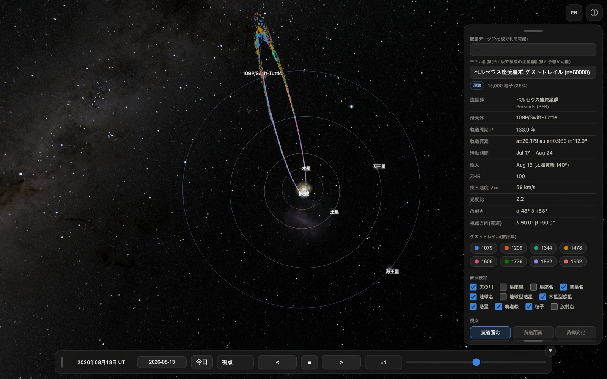
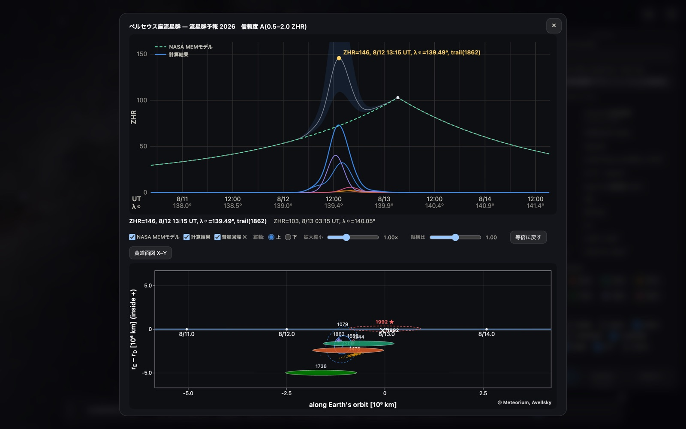
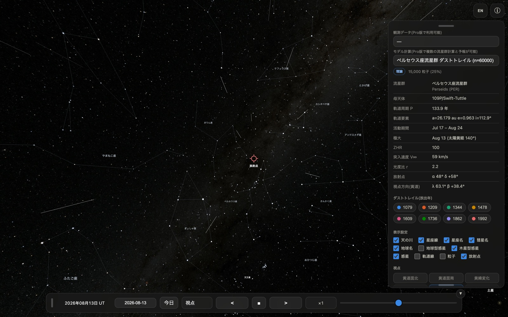

# Meteorium for Mac ユーザーマニュアル(無料版)

Meteorium は、流星群のもとになる「ダストトレイル」(彗星が軌道上に残した塵の帯)を
科学計算に基づいて 3D 表示する天文アプリです。無料版には、ペルセウス座流星群の
母彗星 109P/スウィフト・タトルが残した **8回帰ぶん(1079・1209・1344・1478・
1609・1736・1862・1992年)のダストトレイル 60,000 粒子** が収録されています。

Mac 版は iPhone / iPad 版と同じ計算結果・同じ機能を、macOS のウインドウで
表示するものです。**このマニュアルは Mac 版に固有の操作だけをまとめています。**
機能そのものの説明は
[共通マニュアル](index.html)を参照してください。

- 動作環境: **macOS 15.6 以降**(Apple シリコン / Intel 両対応のユニバーサルアプリ)
- 完全オフライン動作。データ収集・広告なし
- iPhone / iPad 版と同じ App なので、**同じ Apple ID なら追加の費用なく全デバイスで使えます**

---

## 1. ウインドウと画面の構成

Mac 版はふつうの macOS ウインドウとして開きます。ウインドウの端をドラッグして
自由な大きさに変えられ、画面の広さに合わせて 3D 表示も追従します。

| 場所 | 内容 |
|---|---|
| 中央 | 3D 表示(ドラッグ=視点回転、ホイール/トラックパッド=ズーム)|
| 右上 | EN/JP(言語切替)、ⓘ(パネル開閉)|
| 右パネル | データセット・ダストトレイル凡例・表示設定・視点・粒子設定 |
| 下部バー | 日時(UT)・日付入力・今日・視点・時間操作 |

**iPhone 版との違い**: 起動時のウインドウ幅が 900 ピクセル以上あると、右パネルが
最初から開いた状態で表示されます(iPhone では ⓘ ボタンで開きます)。パネルと
下部バーはつまみ(グリップ)をドラッグしてウインドウ内の好きな位置へ移動でき、
パネル下端のつまみで長さも調整できます。

- 緑ボタン(または `control` + `⌘` + `F`)でフルスクリーン表示になります。
  大きな画面ほど粒子の立体構造が見やすくなります
- ウインドウ幅を 640 ピクセル未満まで狭めると、iPhone 版と同じ縦長のレイアウトに
  切り替わります
- 下部バー右上の **▼** ボタンでバー全体を畳めます(▲ で復元)

## 2. マウス / トラックパッドの操作

| 操作 | 動作 |
|---|---|
| ドラッグ | 視点の回転 |
| スクロールホイール | ズームイン / ズームアウト |
| トラックパッドの2本指スワイプ | ズームイン / ズームアウト |
| トラックパッドのピンチ | ズームイン / ズームアウト |
| つまみをドラッグ | パネル・下部バーの移動 |

地上視点(第5章)では、ドラッグが「空を見回す」操作、スクロールが視野角
(画角)の変更になります。狭くすると望遠、広くすると広角の見え方です。

## 3. キーボード

Meteorium はマウス操作だけで完結しますが、Mac 版では次のキーが使えます。

| キー | 動作 |
|---|---|
| `←` / `→` | 流星群予報の**ダストトレイル断面図**を左右にスクロール(予報ウインドウを開いているときのみ)|
| `⌘` + `W` | ウインドウを閉じる |
| `⌘` + `Q` | Meteorium を終了 |
| `control` + `⌘` + `F` | フルスクリーンの切り替え |

日付欄はクリックしてキーボードから直接入力できます(`YYYY-MM-DD` 形式)。

## 4. 流星群予報の表示

無料版には**ペルセウス座流星群の 2026 年の予報**が収録されています。
右パネルの「予報計算」ボタンを押すと、上に ZHR プロファイル、下にダストトレイル
断面図を並べた予報ウインドウが開きます。

- 上のグラフ: NASA MEM モデル(年間背景)と本モデルの計算結果、および
  ダストトレイル別の色分け寄与
- 下のグラフ: 地球がトレイルを横切る位置を表した断面図。粒子の散布と
  1σ / 2σ の誤差楕円を表示します
- 「黄道面図 X–Y」ボタンで、黄道面上の位置関係を別ウインドウで開けます
  (拡大縮小・ドラッグ移動に対応)

Mac の広い画面ではグラフの目盛りや文字が読みやすく、`←` / `→` キーで
断面図を左右に送りながら細部を確認できます。

無料版が表示できるのは 2026 年のペルセウス座流星群のみです。他の年・他の
流星群の予報は Pro 版(準備中)で計算できます。

## 5. 地上視点の流星ショー

視点の「地上」を選ぶと、地上から放射点方向を見上げた観察視点になります。
活動期間(ペルセウス座群: 7/17〜8/24)の日付では、放射点から流星が
流れる様子が再現されます(表示は ZHR=5,000 相当)。

Mac の大画面では、火球・永続痕・流星クラスターといった珍しい現象が
起きた瞬間も見逃しにくくなります。フルスクリーンにして時間を進めれば、
そのままスクリーンセーバーのように眺められます。

## 6. iPhone / iPad 版との違いまとめ

| | iPhone / iPad | Mac |
|---|---|---|
| 視点の回転 | 1本指ドラッグ | マウスドラッグ |
| ズーム | ピンチ | ホイール / 2本指スワイプ / ピンチ |
| パネルの初期状態 | 畳まれている(ⓘ で開く)| 幅 900px 以上なら開いている |
| 画面の大きさ | 端末固定 | ウインドウ可変・フルスクリーン可 |
| 画面の回転 | 縦横で自動再配置 | なし(ウインドウのリサイズで追従)|
| キーボード | 日付入力のみ | 日付入力 + 断面図スクロール |

収録データ・計算結果・表示内容は全プラットフォームで同一です。

## 7. うまく動かないときは

- **動作が重い**: 右パネルの「表示粒子数」を 25% や 10% に下げてください。
  ウインドウを小さくするか、フルスクリーンを解除するのも効果があります
- **画面が真っ暗なまま**: ウインドウをいったんリサイズしてみてください。
  それでも直らない場合は `⌘` + `Q` で終了して再度起動してください
- **表示が以前のまま更新されない**: App Store でアップデートしたあとは、
  アプリを完全に終了(`⌘` + `Q`)してから起動し直してください

---
© Meteorium, Avellsky
